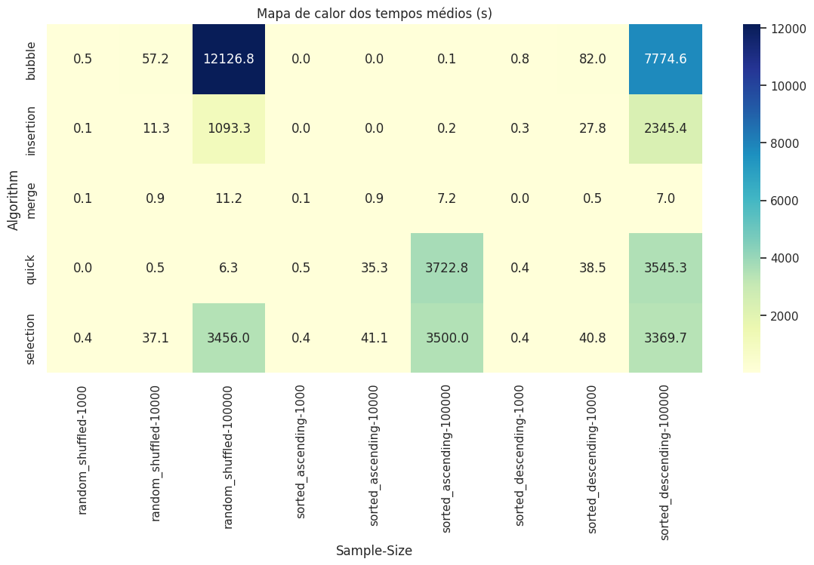
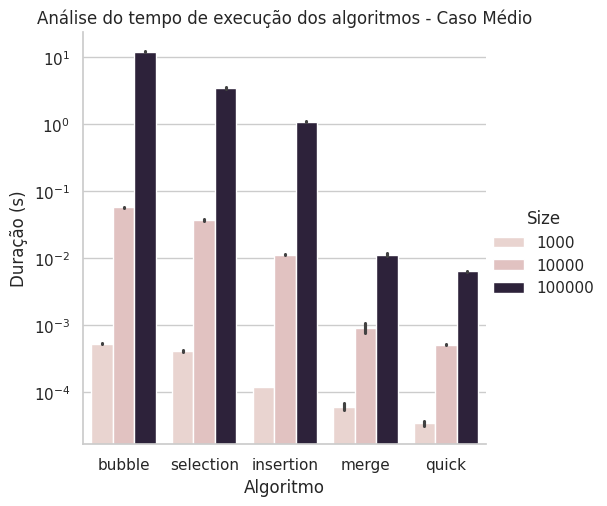
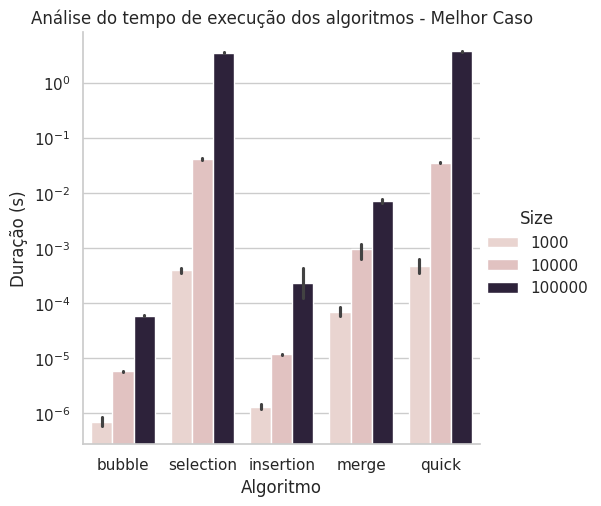
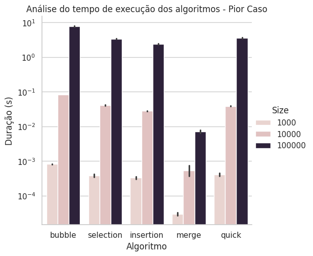
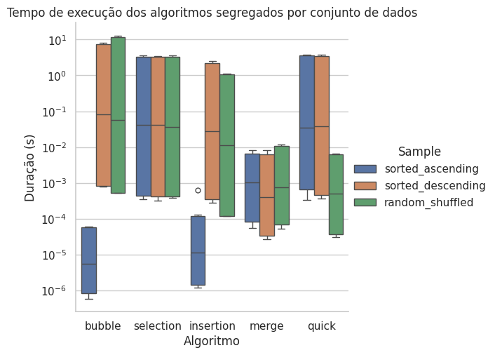

# Resultados e Discussão

A análise experimental dos algoritmos de ordenação foi conduzida em diferentes cenários de entrada e tamanhos de vetor, permitindo uma avaliação crítica da eficiência prática em comparação com a análise assintótica teórica. Os gráficos apresentados a seguir sintetizam os resultados e embasam a discussão.

## Visão geral dos tempos médios

O **mapa de calor dos tempos médios** (Figura 1) fornece uma visão integrada dos resultados. Observa-se que algoritmos quadráticos (*Bubble Sort*, *Selection Sort* e *Insertion Sort*) apresentam tempos de execução que crescem rapidamente com o aumento do tamanho da entrada, chegando a valores da ordem de milhares de segundos para 100.000 elementos. Em contraste, *Merge Sort* e *Quick Sort* mantêm tempos significativamente menores, confirmando sua escalabilidade superior.

| Algoritmo | Observação prática |
| --------- | ------------------ |
| *Merge Sort* | apresenta tempos estáveis e previsíveis, mas exige memória auxiliar adicional, o que pode ser relevante em aplicações reais. |
| *Quick Sort* | é altamente eficiente em média, mas sua degradação no pior caso evidencia a dependência da estratégia de escolha do pivô. |
| *Insertion Sort* | é competitivo em vetores pequenos ou quase ordenados, sendo útil em algoritmos híbridos. |
| *Bubble Sort* e *Selection Sort* | confirmam sua ineficiência prática, mesmo em cenários favoráveis. |

*Figura 1 – Mapa de calor dos tempos médios de execução dos algoritmos.*

## Caso médio

No **caso médio** (Figura 2), *Quick Sort* e *Merge Sort* destacam-se como os algoritmos mais eficientes, mesmo em entradas grandes. *Insertion Sort* apresenta desempenho competitivo apenas em vetores pequenos, enquanto *Bubble Sort* e *Selection Sort* tornam-se inviáveis para grandes volumes de dados. A escala logarítmica utilizada evidencia a diferença de ordem de grandeza entre algoritmos \(O(n^2)\) e \(O(n log n)\).

*Figura 2 – Tempo de execução dos algoritmos no caso médio.*

## Melhor caso

No **melhor caso** (Figura 3), o *Insertion Sort* apresenta desempenho próximo ao linear quando os dados já estão ordenados, confirmando sua eficiência em cenários favoráveis. *Bubble Sort* também melhora nesse contexto, mas ainda não compete com *Merge Sort* e *Quick Sort* em escalabilidade. Essa análise demonstra que a estrutura inicial dos dados pode favorecer algoritmos simples em situações específicas.

*Figura 3 – Tempo de execução dos algoritmos no melhor caso.*

## Pior caso

No **pior caso** (Figura 4), a diferença entre os algoritmos é mais acentuada. *Bubble Sort*, *Selection Sort* e *Insertion Sort* apresentam tempos extremamente elevados, inviabilizando seu uso em grandes entradas. *Quick Sort* sofre degradação significativa em vetores ordenados ou decrescentes, aproximando-se do comportamento quadrático, mas ainda mantém desempenho superior aos algoritmos \(O(n^2)\). *Merge Sort* permanece estável, confirmando sua robustez independentemente da configuração inicial.

*Figura 4 – Tempo de execução dos algoritmos no pior caso.*

## Comparação por conjunto de dados

A análise segregada por tipo de entrada (Figura 5) mostra como cada algoritmo responde ao ordenamento inicial. *Insertion Sort* é imbatível em vetores já ordenados, *Quick Sort* domina em vetores aleatórios e *Merge Sort* mantém desempenho consistente em todos os cenários. *Bubble Sort* e *Selection Sort* são consistentemente inferiores, independentemente da entrada.

*Figura 5 – Tempo de execução dos algoritmos segregados por conjunto de dados.*

## Discussão crítica

A comparação entre a análise assintótica dos algoritmos e os tempos medidos experimentalmente permite avaliar em que medida a teoria se confirma na prática e onde surgem divergências relevantes.

### Algoritmos Quadráticos (\(O(n^2)\))

Nos algoritmos *Bubble Sort*, *Selection Sort* e *Insertion Sort*, a análise assintótica prevê crescimento quadrático do tempo de execução. Os resultados experimentais confirmam essa tendência: para entradas de 100.000 elementos, os tempos tornam-se inviáveis, chegando a várias ordens de grandeza acima dos algoritmos \(O(n log n)\).
Entretanto, observa-se que:

- *Insertion Sort* apresenta tempos muito baixos em vetores já ordenados, aproximando-se de comportamento linear. Isso evidencia que a análise assintótica não captura totalmente a influência da estrutura inicial dos dados.
- *Bubble Sort* e *Selection Sort* mantêm desempenho consistentemente inferior, mesmo em cenários favoráveis, confirmando sua ineficiência prática.

### Algoritmos Eficiêntes \(O(n log n)\)

*Merge Sort* e *Quick Sort* confirmam a análise assintótica, mantendo tempos proporcionais a \(n log n\). Contudo, há nuances importantes:

- *Merge Sort* apresenta estabilidade em todos os cenários, refletindo fielmente sua complexidade teórica. Os tempos medidos mostram que, embora seja ligeiramente mais lento que *Quick Sort* em dados aleatórios, sua robustez o torna previsível e confiável.
- *Quick Sort* confirma sua eficiência média, mas nos cenários ordenados ou decrescentes os tempos se aproximam dos quadráticos. Isso demonstra que a análise assintótica média não reflete adequadamente o pior caso, que depende da escolha do pivô.

### Influência da Estrutura dos Dados

Os resultados mostram que a análise assintótica, embora essencial para prever a escalabilidade, não é suficiente para explicar o desempenho prático em todos os cenários. A estrutura inicial dos dados exerce influência significativa:

- Vetores ordenados favorecem *Insertion Sort*, tornando-o competitivo em pequenas entradas.
- Vetores aleatórios favorecem *Quick Sort*, que se destaca em eficiência.
- *Merge Sort* mantém desempenho consistente, independentemente da entrada, confirmando sua robustez teórica e prática.
